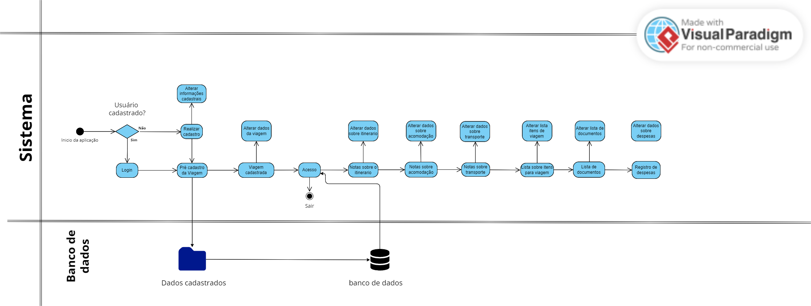
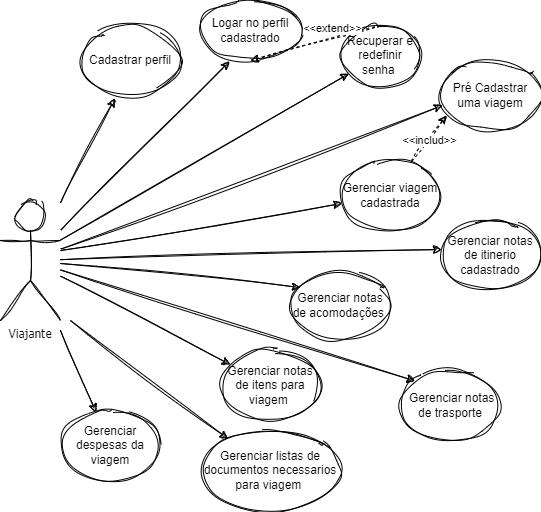
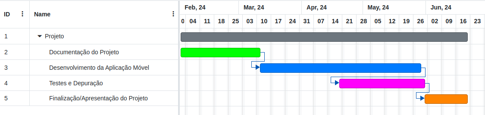

# Especificações do Projeto

O desenvolvimento deste software destinado ao planejamento de viagens é motivado pela crescente demanda por soluções que facilitem e otimizem o processo de organização de viagens. Serão utilizadas técnicas como entrevistas, pesquisa de mercado e criação de personas para compreender as necessidades dos usuários. As histórias de usuários descreverão as tarefas que os usuários desejam realizar na aplicação. Com base nisso, os requisitos funcionais e não funcionais irão garantir que a aplicação atenda às expectativas de desempenho, segurança e usabilidade. Por fim, consideramos as restrições do projeto, como limitações técnicas e orçamentárias. 

## Personas

<figure style="display: flex; align-items: flex-start;">
  
  <figcaption> <b>Pedro Paulo</b>:  
Pedro Paulo tem 26 anos, é um jovem arquiteto cheio de ambição e entusiasmo pela vida. Desde que se formou na faculdade de arquitetura, ele tem buscado maneiras de se desenvolver profissionalmente e expandir seus horizontes. Sua paixão pela arquitetura é complementada por sua paixão por viajar e explorar diferentes culturas ao redor do mundo. Pedro tem como objetivo encontar um aplicativo que o ajude a organizar suas viagens de forma eficiente e prática, manter controle de seus gastos durante as viagens, facilitar o planejamento de acomodações e transporte em suas viagens pelo mundo. No entanto, Pedro enfrenta desafios como controlar seus gastos e manter as finanças em ordem durante suas viagens. Além disso, busca uma solução que centralize todas as informações e facilite o planejamento da viagem. Apesar dos desafios, Pedro está determinado a encontrar uma solução que o ajude a tornar suas viagens mais organizadas e proveitosas.  
  </figcaption>
</figure>

<figure style="display: flex; align-items: flex-start;">
  
  <figcaption> <b>Ana Maria</b>:  
Ana Maria é uma mulher empreendedora de 35 anos, que gerencia com sucesso sua própria agência de marketing digital ao lado de seu esposo. Apesar de sua vida profissional agitada, ela valoriza muito seu tempo livre e adora viajar com o marido sempre que possível. Ana Maria busca experiências autênticas em seus destinos, aproveitando para relaxar e conhecer novas culturas. Seu objetivo é manter o equilíbrio entre sua vida pessoal e profissional, explorar novos destinos e culturas com seu esposo durante suas viagens, e encontrar ferramentas eficazes que facilitem o planejamento e a organização de suas viagens em casal. Ana encontra desafios como conciliar sua agenda profissional com os planos de viagem em família, encontrar soluções que atendam às necessidades tanto dela quanto do marido durante as viagens, e garantir que a experiência de viagem seja tranquila e memorável para ambos.  
  </figcaption>
</figure>

<figure style="display: flex; align-items: flex-start;">
  
  <figcaption> <b>Luís Afonso</b>:  
Luís Afonso é um engenheiro de software de 30 anos, apaixonado por tecnologia e inovação. Ele adora viajar nas férias para relaxar e conhecer novos lugares. Como um profissional ocupado, Luís busca soluções eficientes e tecnológicas para ajudá-lo a organizar suas viagens de forma rápida e conveniente. Luis tem como objetivo encontrar uma maneira eficaz de planejar e organizar suas viagens, aproveitar ao máximo cada destino, explorando pontos turísticos e atividades interessantes, ter controle sobre seus gastos durante as viagens e manter-se dentro do orçamento planejado. Diante disso, Luis enfrenta problemas como encontrar tempo para planejar suas viagens devido ao seu horário de trabalho ocupado, lidar com a complexidade de organizar itinerários e acomodações, transportes durante as viagens.  
  </figcaption>
</figure>

<figure style="display: flex; align-items: flex-start;">
  
  <figcaption> <b>Sofia Almeida</b>:  
Sofia Almeida é uma médica de 45 anos, mãe de dois filhos adolescentes, e tem uma agenda bastante agitada devido às suas responsabilidades profissionais e familiares. Ela adora viajar com a família nas férias para aproveitar o tempo juntos e relaxar. No entanto, Sofia enfrenta desafios ao planejar suas viagens devido à complexidade de conciliar a falta de tempo e os interesses de todos os membros da família. Sofia tem como objetivo garantir que suas viagens sejam seguras e confortáveis para todos,
manter-se dentro do orçamento familiar durante as viagens.  
  </figcaption>
</figure>

<figure style="display: flex; align-items: flex-start;">
  
  <figcaption> <b>Maria Maia</b>:  
Maria Maia tem 28 anos e é assistente administrativa em uma pequena empresa. Ela é uma pessoa simples e prática, que gosta de aproveitar seu tempo livre para viajar e explorar novos lugares. Maria busca uma solução que facilite o planejamento de suas viagens de forma descomplicada. Ela não tem muita experiência em organizar viagens e prefere algo fácil de usar. Maria precisa de um aplicativo que ofereça funcionalidades básicas, como cadastrar suas viagens, gerenciar itinerários e manter controle de gastos, de maneira intuitiva e direta. Ela espera que essa solução a ajude a planejar suas viagens de forma eficiente, sem complicação.  
  </figcaption>
</figure>

<figure style="display: flex; align-items: flex-start;">
  
  <figcaption> <b>André Lima</b>:  
André Lima tem 32 anos e trabalha como contador em uma empresa de médio porte. Ele é um homem prático e organizado, que gosta de viajar nas férias para relaxar e aproveitar momentos de lazer. André busca uma solução que o ajude a planejar suas viagens de forma eficiente, sem muita complicação. Ele não é muito experiente em organizar viagens, mas deseja algo que seja fácil de usar e que o ajude a manter tudo sob controle. Ele espera que essa solução o ajude a aproveitar ao máximo suas viagens, sem precisar se preocupar com detalhes complicados.  
  </figcaption>
</figure>

## Histórias de Usuários

Com base na análise das personas forma identificadas as seguintes histórias de usuários:

|EU COMO... `PERSONA`| QUERO/PRECISO ... `FUNCIONALIDADE` |PARA ... `MOTIVO/VALOR`                 |
|--------------------|------------------------------------|----------------------------------------|
| Pedro  | Cadastrar em um aplicativo e registrar todas as minhas despesas de viagem. | Para organizar minha viagem e ter um controle detalhado dos meus gastos durante os meus passeios. |
| Pedro  |  Criar listas de itens necessarios para viagem. | Garantir que eu esteja preparado para todas as eventualidades durante minhas viagens. |
| Ana  |  Adicionar notas detalhadas sobre o itinerário da minha viagem, incluindo locais a serem visitados, atividades planejadas e horários. | Aproveitar ao máximo minhas viagens, explorando os pontos turísticos, atividades e experiências que mais me interessam. |
| Ana  |   Poder recuperar o acesso à minha conta no aplicativo. | Para caso eu esqueça minha senha atual ou tenha problemas de login, quero garantir que eu possa continuar a usar o aplicativo sem problemas. |
| Luis  |  Criar e editar listas para organizar itens específicos da minha viagem, como itens para fazer as malas, lista de compras |  Garantir que não esqueça nada importante e tenha uma viagem mais tranquila e sem contratempos |
| Luis  |  Adicionar notas específicas sobre a acomodação, como informações de reserva, endereço, contato do hotel e comodidades disponíveis |  Ter todos os detalhes importantes sobre minha estadia registrados e acessíveis em um só lugar |
| Sofia  |  Adicionar notas relacionadas ao transporte, como detalhes de voos, horários de trens, reservas de ônibus ou aluguel de carros | Organizar minha logística de viagem de forma eficiente e garantir deslocamentos suaves entre os diferentes destinos |
| Sofia  |  Capaz de fazer login no aplicativo.  | Acessar  facilmente o aplicativo e começar a planejar minhas viagens de forma rápida e conveniente. |
| Maria |  Realizar cadastros de viagens no aplicativo, fornecendo detalhes como destino, data de chegada e data de saída. | Facilitar o planejamento e a organização das nossas viagens em família. |
| Maria | Registrar todas as minhas despesas durante minhas viagens. | Manter o controle dos meus gastos. |
| André | Capaz de criar uma lista de documentos necessários para a viagem, como RG, CPF e passaporte. | Garantir que eu tenha todos os documentos importantes à mão durante minhas viagens de forma fácil e organizada. |
| André | Ter a opção de editar ou excluir os detalhes das minhas viagens cadastradas a qualquer momento. | Caso meu destino mude ou a viagem seja adiada. |

## Modelagem do Processo de Negócio
### Análise da Situação Atual

Contexto Atual do Turismo
O setor de turismo está em expansão contínua, com a democratização das viagens e a crescente oferta de destinos e experiências. Com a evolução do capitalismo, viajar se tornou mais acessível, o que por um lado facilita o acesso a diferentes destinos e, por outro, complica o processo de planejamento devido à vasta gama de opções disponíveis.

Desafios no Planejamento de Viagens
Planejar uma viagem envolve diversas etapas e considerações, como:

Escolha do destino: Influenciada por fatores como orçamento, interesses pessoais, clima e eventos locais.
Transporte: Seleção de voos, transporte terrestre, aluguel de carros, etc.
Hospedagem: Escolha entre hotéis, aluguéis de temporada, hostels, etc.
Roteiro de atividades: Organização de passeios, reservas em atrações turísticas, planejamento de tempo livre.
Orçamento: Controle e monitoramento de despesas previstas e imprevistas.
Muitos viajantes relatam sentir-se sobrecarregados pelo volume de informações e pela complexidade das decisões envolvidas. A falta de ferramentas integradas que simplifiquem e centralizem essas tarefas contribui para um processo de planejamento fragmentado e estressante.
Segundo a pesquisa do Ministério do Turismo Brasileiro e do Instituto de Pesquisa de Reputação e Imagem (IPRI, 2023), os viajantes brasileiros iniciam o planejamento de suas viagens com antecedência variada, sendo que 52% começam com três meses e 30% com um mês. Os fatores principais considerados incluem orçamento, duração, definição de destino, roteiro, meios de transporte e hospedagem. A demanda por soluções que ofereçam autonomia e eficiência no planejamento é crescente.

Um aplicativo de planejamento de viagens é extremamente útil pelas seguintes razões:

**1. Facilitação do Planejamento de Atividades:**
- A ferramenta centraliza todas as etapas do planejamento de uma viagem, desde a escolha do destino até a organização do roteiro diário. Isso simplifica o processo e torna mais fácil para os viajantes gerenciarem suas atividades de maneira eficiente.

**2. Redução do Tempo de Planejamento:**
- Automatizando tarefas repetitivas e fornecendo recomendações personalizadas, o software reduz significativamente o tempo necessário para planejar uma viagem. Isso é especialmente útil para viajantes frequentes e de negócios que têm pouco tempo disponível.

**3. Controle do Orçamento:**
- O software permite que os viajantes definam e acompanhem seu orçamento em tempo real, oferecendo alertas e relatórios detalhados de despesas. Isso ajuda a evitar gastos excessivos e a manter a viagem dentro dos limites financeiros planejados.

**4. Redução do Estresse e Frustração:**
- Ao simplificar e organizar o processo de planejamento, o software diminui o estresse e a frustração frequentemente associados a esta tarefa, resultando em uma experiência de viagem mais agradável e tranquila.

**5. Acompanhamento em Tempo Real:**
- Recursos de monitoramento em tempo real permitem que os viajantes ajustem seus planos conforme necessário durante a viagem, lidando de maneira proativa com imprevistos e mudanças de última hora.

**6. Aumento da Autonomia:**
- Como apontado por pesquisas, os viajantes contemporâneos buscam maior autonomia no planejamento de suas viagens. A solução tecnológica proporciona as ferramentas necessárias para que os usuários possam planejar suas viagens de maneira independente e personalizada.

A análise da situação atual destaca a complexidade e fragmentação do processo de planejamento de viagens, indicando uma forte demanda por uma solução integrada e personalizada. O desenvolvimento de um software que atenda a essas necessidades pode transformar uma experiência potencialmente estressante em um processo simplificado, eficiente e agradável, proporcionando aos viajantes uma ferramenta poderosa para otimizar suas jornadas.

## Descrição geral da proposta
A proposta consiste no desenvolvimento de um aplicativo de planejamento de viagens, focado em tornar o processo de organização de viagens mais simples, eficiente e personalizado. O sistema visa resolver os desafios comuns enfrentados pelos viajantes, como a complexidade do planejamento, a gestão do orçamento e a personalização da experiência de viagem.

  
## Indicadores de Desempenho

Com os indicadores de desempenho constituímos um conjunto de medidas onde avaliamos o desempenho do aplicativo ao longo do tempo.

## Requisitos

As tabelas que se seguem apresentam os requisitos funcionais e não funcionais que detalham o escopo do projeto. Para determinar a prioridade de requisitos, aplicar uma técnica de priorização de requisitos e detalhar como a técnica foi aplicada.

### Requisitos Funcionais

| ID    | Descrição do Requisito                                                                                                 | Prioridade | Histórias de Usuarios |
|-------|--------------------------------------------------------------------------------------------------------------------------|------------|----------------------|
| RF-001 (Cadastro de Usuários)| Os usuários devem poder se cadastrar na aplicação fornecendo um nome de usuário único, um endereço de e-mail único e válido e uma senha segura. | ALTA       | Pedro |
| RF-002 (Login de Usuários)| Os usuários devem poder fazer login na aplicação usando seu nome de usuário/e-mail e senha.                              | ALTA  | Sofia |
| RF-003 (Recuperação de Senha)| Os usuários devem poder recuperar o acesso à sua conta seguindo um processo seguro de redefinição de senha.               | MÉDIA       | Ana |
| RF-004 (Pré-Cadastro de Viagem)| Os usuários devem poder realizar um pré-cadastro de viagem, fornecendo detalhes como destino, data de chegada e data de saída. | ALTA | Maria |
| RF-005 (Gerenciamento de Pré-Cadastro de Viagem)| Os usuários devem ter a opção de editar ou excluir os detalhes do pré-cadastro de viagem a qualquer momento.             | ALTA | André | 
| RF-006 (Gerenciamento de Notas sobre Itinerário da Viagem)| Os usuários devem poder adicionar ou editar notas detalhadas sobre o itinerário da viagem, incluindo locais a serem visitados, atividades planejadas e horários.| ALTA | Ana |
| RF-007 (Notas sobre Acomodação)| Os usuários devem poder adicionar e editar notas específicas sobre a acomodação, como informações de reserva, endereço, contato do hotel e comodidades disponíveis. | MÉDIA | Luis |
| RF-008 (Notas sobre Transporte)| Os usuários devem poder adicionar e editar notas relacionadas ao transporte, como detalhes de voos, horários de trens, reservas de ônibus ou aluguel de carros. | ALTA | Sofia | 
| RF-009 (Listas Personalizadas de Itens para Viagem)| Os usuários devem poder criar e editar listas personalizadas para organizar itens específicos da viagem, como itens para fazer as malas, lista de compras, etc. | ALTA | Luis |
| RF-010 (Listas Personalizadas de Documentos)| Os usuários devem poder criar e editar listas personalizadas para organizar os documentos necessários para a viagem, como RG, CPF, passaporte, etc. | MÉDIA | André |
| RF-011 (Registro de Despesas)| Os usuários devem poder registrar e editar despesas incorridas durante a viagem, como custos de transporte, acomodação, alimentação e atividades adicionais. | ALTA | Pedro |
| Todos os requisitos foram analisados e aprovados por todos os stakeholders do projeto. |

### Priorização dos Requisitos 

| Requisito | Justificativa | 
|-----------|---------------|
|RF-001 (Cadastro de Usuários)| Esse requisito foi classificado como ALTA prioridade porque é fundamental para a funcionalidade básica da aplicação. Sem um sistema de cadastro de usuários, os usuários não poderão acessar a aplicação e utilizar seus recursos principais. |
|RF-002 (Login de Usuários)| Também classificado como ALTA prioridade, o login de usuários é essencial para garantir que apenas usuários autorizados possam acessar a aplicação. Sem essa funcionalidade, o sistema não seria capaz de distinguir entre diferentes usuários e fornecer acesso personalizado aos seus dados e recursos. |
|RF-003 (Recuperação de Senha)| Embora importante, este requisito foi classificado como MÉDIA prioridade porque, embora seja útil para garantir a usabilidade e a conveniência dos usuários, não é tão crítico quanto os requisitos de cadastro e login. A recuperação de senha é mais uma funcionalidade de apoio do que uma funcionalidade central para a operação da aplicação. |
|RF-004 (Pré-Cadastro de Viagem)| Este requisito foi classificado como ALTA prioridade, pois permite aos usuários iniciar o processo de planejamento de suas viagens, fornecendo informações essenciais como destino e datas de viagem. Isso é fundamental para a funcionalidade principal da aplicação e para atender às necessidades dos usuários. |
|RF-005 (Gerenciamento de Pré-Cadastro de Viagem)| Considerado também ALTA prioridade, este requisito é crucial para a usabilidade e a flexibilidade da aplicação. Os usuários devem ter a capacidade de editar ou excluir detalhes de suas viagens conforme necessário para refletir mudanças nos planos de viagem ou atualizações de informações. |
|RF-006 (Gerenciamento de Notas sobre Itinerário da Viagem)| Classificado como ALTA prioridade, esse requisito permite aos usuários personalizar e organizar seus itinerários de viagem de acordo com suas preferências e necessidades. Essa funcionalidade é central para a experiência do usuário e para garantir que eles possam gerenciar eficazmente suas viagens. |
|RF-007 (Notas sobre Acomodação)| Este requisito foi classificado como MÉDIA prioridade, pois embora seja útil para os usuários registrarem detalhes sobre sua acomodação, não é tão crítico quanto os requisitos que envolvem o planejamento e a gestão das viagens em si. Ainda assim, é importante para oferecer uma experiência completa aos usuários. |
|RF-008 (Notas sobre Transporte)| Classificado como ALTA prioridade, este requisito permite aos usuários registrar detalhes importantes sobre seu transporte durante a viagem, como voos, trens ou aluguel de carros. Isso é crucial para o planejamento e a execução bem-sucedida da viagem. |
|RF-009 (Listas Personalizadas de Itens para Viagem)| Classificado como ALTA prioridade, esse requisito é fundamental para permitir que os usuários organizem e planejem os aspectos práticos de suas viagens, como fazer as malas e fazer compras específicas para a viagem. |
|RF-010 (Listas Personalizadas de Documentos)| Considerado MÉDIA prioridade, este requisito é importante para garantir que os usuários possam manter todos os documentos necessários para a viagem de forma organizada, mas pode não ser tão crucial quanto outros requisitos relacionados ao planejamento e à execução da viagem em si. |
|RF-011 (Registro de Despesas)| Classificado como ALTA prioridade, esse requisito é essencial para permitir que os usuários gerenciem suas despesas durante a viagem, garantindo que possam manter o controle de seus gastos e orçamentos. Isso é importante para uma viagem bem-sucedida e para evitar surpresas financeiras desagradáveis. |

### Requisitos não Funcionais

|ID     | Descrição do Requisito  |Prioridade |
|-------|-------------------------|----|
|RNF-001| O aplicativo deve ser rápido e responsivo, garantindo que os usuários possam acessar e manipular informações de suas viagens sem experimentar atrasos significativos ou lentidão na interface. | MÉDIA | 
|RNF-002| O aplicativo deve processar as solicitações dos usuários em um tempo máximo de 3 segundos, garantindo uma experiência ágil e sem interrupções. |  BAIXA | 
|RNF-003| O aplicativo deve assegurar a proteção integral dos dados dos usuários, aderindo rigorosamente aos requisitos da LGPD (Lei Geral de Proteção de Dados), incluindo a garantia de confidencialidade, integridade e disponibilidade dos dados pessoais dos usuários.  | MÉDIA |
|RNF-004| O aplicativo deve ser desenvolvido utilizando a tecnologia React Native. | ALTA |

## Restrições

O projeto está restrito pelos itens apresentados na tabela a seguir.

|ID| Restrição                                             |
|--|-------------------------------------------------------|
|RE-01| O projeto deverá ser entregue até 23/06/2024. |
|RE-02| Não pode ser desenvolvido um módulo de backend. |
|RE-03| A aplicação deve ser desenvolvida exclusivamente pelos membros do grupo. |

## Diagrama de Casos de Uso

A aplicação deverá ordenar de forma prática e fácil todas as etapas e percursos de viagens, tornando o ambiente mais atrativo para o usuário. Além de pré cadastrar seu destino, usuário poderá incluir listas editáveis para conferência de documentos pessoais e itens necessários para viagem. Notas poderão ser adicionadas fornecendo detalhes a respeito de todo itinerário, transportes que serão utilizados e hospedagens agendadas. Por fim, o usuário poderá gerenciar as despesas da viagem, podendo ter uma estimativa de todos gastos.

# Matriz de Rastreabilidade

A matriz de rastreabilidade é uma ferramenta usada para facilitar a visualização dos relacionamento entre requisitos e outros artefatos ou objetos, permitindo a rastreabilidade entre os requisitos e os objetivos de negócio. 

Utilizando os requisitos funcionais descritos no projeto, definimos a rastreabilidade dos requisitos necessários para o funcionamento do sistema:

|   ID   | RF-001 | RF-002 | RF-003 | RF-004 | RF-005 | RF-006 | RF-007 | RF-008 | RF-009 | RF-010 | RF-011 |
|--------|--------|--------|--------|--------|--------|--------|--------|--------|--------|--------|--------|
| RF-001 |        |   x    |   x    |        |        |        |        |        |        |        |        |
| RF-002 |   x    |        |   x    |        |        |        |        |        |        |        |        |
| RF-003 |   x    |   x    |        |        |        |        |        |        |        |        |        |
| RF-004 |        |        |        |        |   x    |   x    |   x    |   x    |   x    |   x    |   x    |
| RF-005 |        |        |        |        |        |        |        |        |        |        |        |
| RF-006 |        |        |        |        |        |        |   x    |   x    |        |        |        |
| RF-007 |        |        |        |        |        |   x    |        |   x    |        |        |        |
| RF-008 |        |        |        |        |        |   x    |   x    |        |        |        |        |
| RF-009 |        |        |        |        |        |        |        |        |        |   x    |        |
| RF-010 |        |        |        |        |        |        |        |        |   x    |        |        |
| RF-011 |        |        |        |        |        |        |        |        |        |        |        |

# Gerenciamento de Projeto

De acordo com o PMBoK v6 as dez áreas que constituem os pilares para gerenciar projetos, e que caracterizam a multidisciplinaridade envolvida, são: Integração, Escopo, Cronograma (Tempo), Custos, Qualidade, Recursos, Comunicações, Riscos, Aquisições, Partes Interessadas. Para desenvolver projetos um profissional deve se preocupar em gerenciar todas essas dez áreas. Elas se complementam e se relacionam, de tal forma que não se deve apenas examinar uma área de forma estanque. É preciso considerar, por exemplo, que as áreas de Escopo, Cronograma e Custos estão muito relacionadas. Assim, se eu amplio o escopo de um projeto eu posso afetar seu cronograma e seus custos.

## Gerenciamento de Tempo

Com diagramas bem organizados que permitem gerenciar o tempo nos projetos, o gerente de projetos agenda e coordena tarefas dentro de um projeto para estimar o tempo necessário de conclusão.

O gráfico de Gantt ou diagrama de Gantt também é uma ferramenta visual utilizada para controlar e gerenciar o cronograma de atividades de um projeto. Com ele, é possível listar tudo que precisa ser feito para colocar o projeto em prática, dividir em atividades e estimar o tempo necessário para executá-las.

## Gerenciamento de Equipe

O gerenciamento adequado de tarefas contribuirá para que o projeto alcance altos níveis de produtividade. Por isso, é fundamental que ocorra a gestão de tarefas e de pessoas, de modo que os times envolvidos no projeto possam ser facilmente gerenciados. 

## Gestão de Orçamento

O processo de determinar o orçamento do projeto é uma tarefa que depende, além dos produtos (saídas) dos processos anteriores do gerenciamento de custos, também de produtos oferecidos por outros processos de gerenciamento, como o escopo e o tempo.

## Explicação dos Valores

Recursos Humanos: Este é o maior investimento porque a qualidade e a eficiência do desenvolvimento do app dependem diretamente da equipe envolvida. Profissionais qualificados garantem a entrega de um produto que atenda às expectativas do mercado e dos usuários finais.

Hardware: O desenvolvimento de apps exige testes em diferentes dispositivos e plataformas para garantir compatibilidade e desempenho. Além disso, servidores robustos são necessários para suportar o desenvolvimento, testes e estágios iniciais do lançamento.

Rede: A conectividade é essencial para o desenvolvimento e operação de apps móveis, especialmente quando se utiliza serviços baseados em cloud, que requerem uma internet estável e rápida.

Software: O desenvolvimento de apps móveis requer diversas ferramentas especializadas, desde ambientes de desenvolvimento até ferramentas de design e testes. Além disso, muitos apps integram APIs externas para adicionar funcionalidades, como mapas ou sistemas de pagamento, que geralmente têm custos associados.

Serviços: A consultoria e outros serviços profissionais podem ser necessários para áreas específicas do desenvolvimento do app, como segurança cibernética, marketing digital e otimização para lojas de apps. Esses serviços complementam a expertise interna e ajudam a assegurar o sucesso do app no mercado competitivo.

