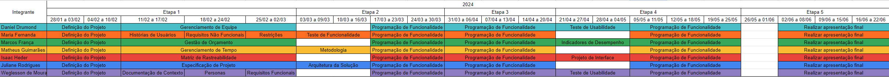
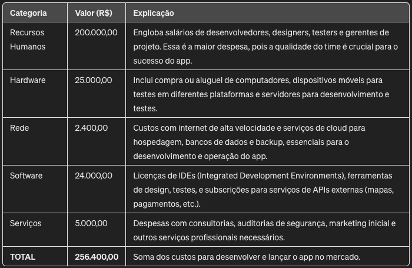

# Especificações do Projeto

O desenvolvimento deste software destinado ao planejamento de viagens é motivado pela crescente demanda por soluções que facilitem e otimizem o processo de organização de viagens. Serão utilizadas técnicas como entrevistas, pesquisa de mercado e criação de personas para compreender as necessidades dos usuários. As histórias de usuários descreverão as tarefas que os usuários desejam realizar na aplicação. Com base nisso, os requisitos funcionais e não funcionais irão garantir que a aplicação atenda às expectativas de desempenho, segurança e usabilidade. Por fim, consideramos as restrições do projeto, como limitações técnicas e orçamentárias. 

## Personas

Pedro Paulo tem 26 anos, é um jovem arquiteto cheio de ambição e entusiasmo pela vida. Desde que se formou na faculdade de arquitetura, ele tem buscado maneiras de se desenvolver profissionalmente e expandir seus horizontes. Sua paixão pela arquitetura é complementada por sua paixão por viajar e explorar diferentes culturas ao redor do mundo. Pedro tem como objetivo organizar suas viagens de forma eficiente e prática, manter controle de seus gastos durante as viagens, facilitar o planejamento de acomodações e transporte em suas viagens pelo mundo. No entanto, Pedro enfrenta desafios como controlar seus gastos e manter as finanças em ordem durante suas viagens. Além disso, busca uma solução que centralize todas as informações e facilite o planejamento da viagem. Apesar dos desafios, Pedro está determinado a encontrar uma solução que o ajude a tornar suas viagens mais organizadas e proveitosas.

Ana Maria é uma mulher empreendedora de 35 anos, que gerencia com sucesso sua própria agência de marketing digital ao lado de seu esposo. Apesar de sua vida profissional agitada, ela valoriza muito seu tempo livre e adora viajar com o marido sempre que possível. Ana Maria busca experiências autênticas em seus destinos, aproveitando para relaxar e conhecer novas culturas. Seu objetivo é manter o equilíbrio entre sua vida pessoal e profissional, explorar novos destinos e culturas com seu esposo durante suas viagens, e encontrar ferramentas eficazes que facilitem o planejamento e a organização de suas viagens em casal. Ana encontra desafios como conciliar sua agenda profissional com os planos de viagem em família, encontrar soluções que atendam às necessidades tanto dela quanto do marido durante as viagens, e garantir que a experiência de viagem seja tranquila e memorável para ambos.

Luís Afonso é um engenheiro de software de 30 anos, apaixonado por tecnologia e inovação. Ele adora viajar nas férias para relaxar e conhecer novos lugares. Como um profissional ocupado, Luís busca soluções eficientes e tecnológicas para ajudá-lo a organizar suas viagens de forma rápida e conveniente. Luis tem como objetivo encontrar uma maneira eficaz de planejar e organizar suas viagens, aproveitar ao máximo cada destino, explorando pontos turísticos e atividades interessantes, ter controle sobre seus gastos durante as viagens e manter-se dentro do orçamento planejado. Diante disso, Luis enfrenta problemas como encontrar tempo para planejar suas viagens devido ao seu horário de trabalho ocupado, lidar com a complexidade de organizar itinerários e acomodações, transportes durante as viagens.

Sofia Almeida é uma médica de 45 anos, mãe de dois filhos adolescentes, e tem uma agenda bastante agitada devido às suas responsabilidades profissionais e familiares. Ela adora viajar com a família nas férias para aproveitar o tempo juntos e relaxar. No entanto, Sofia enfrenta desafios ao planejar suas viagens devido à complexidade de conciliar a falta de tempo e os interesses de todos os membros da família. Sofia tem como objetivo garantir que suas viagens sejam seguras e confortáveis para todos,
manter-se dentro do orçamento familiar durante as viagens.
## Histórias de Usuários

Com base na análise das personas forma identificadas as seguintes histórias de usuários:

|EU COMO... `PERSONA`| QUERO/PRECISO ... `FUNCIONALIDADE` |PARA ... `MOTIVO/VALOR`                 |
|--------------------|------------------------------------|----------------------------------------|
| Pedro  | Registrar todas as minhas despesas de viagem          | Para ter um controle detalhado dos meus gastos durante os meus passeios             |
| Pedro  |  Criar listas  personalizadas                | Garantir que eu esteja preparado para todas as eventualidades durante minhas viagens |
| Ana  |  Adicionar notas detalhadas sobre o itinerário da minha viagem, incluindo locais a serem visitados, atividades planejadas e horários | Organizar minha agenda e garantir que eu aproveite ao máximo cada destino durante minha viagem |
| Ana  |  Criar itinerários personalizados   | Aproveitar ao máximo cada viagem, explorando os pontos turísticos, atividades e experiências que mais os interessam |
| Luis  |  Criar e editar listas personalizadas para organizar itens específicos da minha viagem, como itens para fazer as malas, lista de compras |  Garantir que não esqueça nada importante e tenha uma viagem mais tranquila e sem contratempos |
| Luis  |  Adicionar notas específicas sobre a acomodação, como informações de reserva, endereço, contato do hotel e comodidades disponíveis |  Ter todos os detalhes importantes sobre minha estadia registrados e acessíveis em um só lugar |
| Sofia  |  Adicionar notas relacionadas ao transporte, como detalhes de voos, horários de trens, reservas de ônibus ou aluguel de carros | Organizar minha logística de viagem de forma eficiente e garantir deslocamentos suaves entre os diferentes destinos |
| Sofia  |  Registrar despesas incorridas durante a viagem, como custos de transporte, acomodação, alimentação e atividades adicionais  | Controlar meus gastos e manter minha viagem dentro do orçamento planejado |

## Modelagem do Processo de Negócio 

### Análise da Situação Atual

Apresente aqui os problemas existentes que viabilizam sua proposta. Apresente o modelo do sistema como ele funciona hoje. Caso sua proposta seja inovadora e não existam processos claramente definidos, apresente como as tarefas que o seu sistema pretende implementar são executadas atualmente, mesmo que não se utilize tecnologia computacional. 

### Descrição Geral da Proposta

Apresente aqui uma descrição da sua proposta abordando seus limites e suas ligações com as estratégias e objetivos do negócio. Apresente aqui as oportunidades de melhorias.

### Processo 1 – NOME DO PROCESSO

Apresente aqui o nome e as oportunidades de melhorias para o processo 1. Em seguida, apresente o modelo do processo 1, descrito no padrão BPMN. 

### Processo 2 – NOME DO PROCESSO

Apresente aqui o nome e as oportunidades de melhorias para o processo 2. Em seguida, apresente o modelo do processo 2, descrito no padrão BPMN.

## Indicadores de Desempenho

Apresente aqui os principais indicadores de desempenho e algumas metas para o processo. Atenção: as informações necessárias para gerar os indicadores devem estar contempladas no diagrama de classe. Colocar no mínimo 5 indicadores. 

Usar o seguinte modelo: 

Obs.: todas as informações para gerar os indicadores devem estar no diagrama de classe a ser apresentado a posteriori. 

## Requisitos

As tabelas que se seguem apresentam os requisitos funcionais e não funcionais que detalham o escopo do projeto. Para determinar a prioridade de requisitos, aplicar uma técnica de priorização de requisitos e detalhar como a técnica foi aplicada.

### Requisitos Funcionais

|ID    | Descrição do Requisito  | Prioridade |
|------|-----------------------------------------|----|
|RF-001| Permitir que o usuário cadastre tarefas | ALTA | 
|RF-002| Emitir um relatório de tarefas no mês   | MÉDIA |

### Requisitos não Funcionais

|ID     | Descrição do Requisito  |Prioridade |
|-------|-------------------------|----|
|RNF-001| O sistema deve ser responsivo para rodar em um dispositivos móvel | MÉDIA | 
|RNF-002| Deve processar requisições do usuário em no máximo 3s |  BAIXA | 

Com base nas Histórias de Usuário, enumere os requisitos da sua solução. Classifique esses requisitos em dois grupos:

- [Requisitos Funcionais
 (RF)](https://pt.wikipedia.org/wiki/Requisito_funcional):
 correspondem a uma funcionalidade que deve estar presente na
  plataforma (ex: cadastro de usuário).
- [Requisitos Não Funcionais
  (RNF)](https://pt.wikipedia.org/wiki/Requisito_n%C3%A3o_funcional):
  correspondem a uma característica técnica, seja de usabilidade,
  desempenho, confiabilidade, segurança ou outro (ex: suporte a
  dispositivos iOS e Android).
Lembre-se que cada requisito deve corresponder à uma e somente uma
característica alvo da sua solução. Além disso, certifique-se de que
todos os aspectos capturados nas Histórias de Usuário foram cobertos.

## Restrições

O projeto está restrito pelos itens apresentados na tabela a seguir.

|ID| Restrição                                             |
|--|-------------------------------------------------------|
|01| O projeto deverá ser entregue até o final do semestre |
|02| Não pode ser desenvolvido um módulo de backend        |

Enumere as restrições à sua solução. Lembre-se de que as restrições geralmente limitam a solução candidata.

> **Links Úteis**:
> - [O que são Requisitos Funcionais e Requisitos Não Funcionais?](https://codificar.com.br/requisitos-funcionais-nao-funcionais/)
> - [O que são requisitos funcionais e requisitos não funcionais?](https://analisederequisitos.com.br/requisitos-funcionais-e-requisitos-nao-funcionais-o-que-sao/)

## Diagrama de Casos de Uso

O diagrama de casos de uso é o próximo passo após a elicitação de requisitos, que utiliza um modelo gráfico e uma tabela com as descrições sucintas dos casos de uso e dos atores. Ele contempla a fronteira do sistema e o detalhamento dos requisitos funcionais com a indicação dos atores, casos de uso e seus relacionamentos. 

As referências abaixo irão auxiliá-lo na geração do artefato “Diagrama de Casos de Uso”.

> **Links Úteis**:
> - [Criando Casos de Uso](https://www.ibm.com/docs/pt-br/elm/6.0?topic=requirements-creating-use-cases)
> - [Como Criar Diagrama de Caso de Uso: Tutorial Passo a Passo](https://gitmind.com/pt/fazer-diagrama-de-caso-uso.html/)
> - [Lucidchart](https://www.lucidchart.com/)
> - [Astah](https://astah.net/)
> - [Diagrams](https://app.diagrams.net/)

# Matriz de Rastreabilidade

A matriz de rastreabilidade é uma ferramenta usada para facilitar a visualização dos relacionamento entre requisitos e outros artefatos ou objetos, permitindo a rastreabilidade entre os requisitos e os objetivos de negócio. 

A matriz deve contemplar todos os elementos relevantes que fazem parte do sistema, conforme a figura meramente ilustrativa apresentada a seguir.

> **Links Úteis**:
> - [Artigo Engenharia de Software 13 - Rastreabilidade](https://www.devmedia.com.br/artigo-engenharia-de-software-13-rastreabilidade/12822/)
> - [Verificação da rastreabilidade de requisitos usando a integração do IBM Rational RequisitePro e do IBM ClearQuest Test Manager](https://developer.ibm.com/br/tutorials/requirementstraceabilityverificationusingrrpandcctm/)
> - [IBM Engineering Lifecycle Optimization – Publishing](https://www.ibm.com/br-pt/products/engineering-lifecycle-optimization/publishing/)

# Gerenciamento de Projeto

De acordo com o PMBoK v6 as dez áreas que constituem os pilares para gerenciar projetos, e que caracterizam a multidisciplinaridade envolvida, são: Integração, Escopo, Cronograma (Tempo), Custos, Qualidade, Recursos, Comunicações, Riscos, Aquisições, Partes Interessadas. Para desenvolver projetos um profissional deve se preocupar em gerenciar todas essas dez áreas. Elas se complementam e se relacionam, de tal forma que não se deve apenas examinar uma área de forma estanque. É preciso considerar, por exemplo, que as áreas de Escopo, Cronograma e Custos estão muito relacionadas. Assim, se eu amplio o escopo de um projeto eu posso afetar seu cronograma e seus custos.

## Gerenciamento de Tempo

Com diagramas bem organizados que permitem gerenciar o tempo nos projetos, o gerente de projetos agenda e coordena tarefas dentro de um projeto para estimar o tempo necessário de conclusão.

O gráfico de Gantt ou diagrama de Gantt também é uma ferramenta visual utilizada para controlar e gerenciar o cronograma de atividades de um projeto. Com ele, é possível listar tudo que precisa ser feito para colocar o projeto em prática, dividir em atividades e estimar o tempo necessário para executá-las.

## Gerenciamento de Equipe

O gerenciamento adequado de tarefas contribuirá para que o projeto alcance altos níveis de produtividade. Por isso, é fundamental que ocorra a gestão de tarefas e de pessoas, de modo que os times envolvidos no projeto possam ser facilmente gerenciados. 

## Gestão de Orçamento

O processo de determinar o orçamento do projeto é uma tarefa que depende, além dos produtos (saídas) dos processos anteriores do gerenciamento de custos, também de produtos oferecidos por outros processos de gerenciamento, como o escopo e o tempo.

