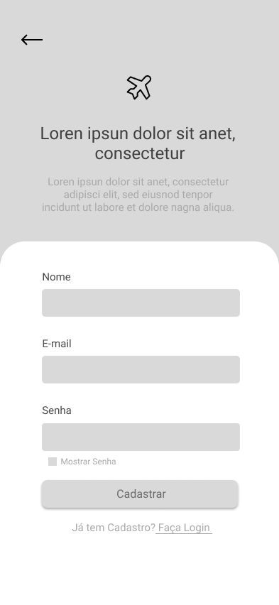
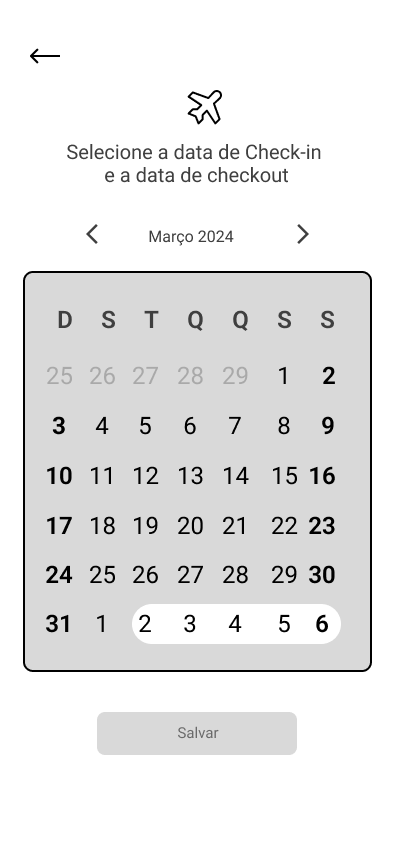
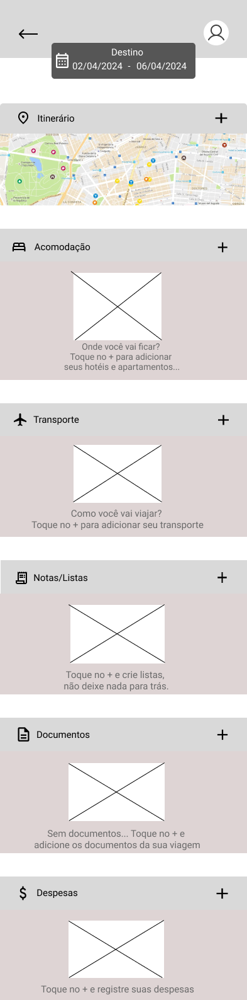
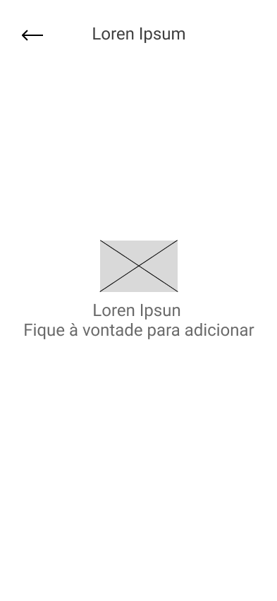

# Projeto de Interface

## Diagrama de Fluxo

Abaixo o diagrama de fluxo com o caminho a ser percorrido pelo usuário final do site.

## Wireframes

## Logo

Ao entrar em nosso aplicativo, você é recebido pela nossa logo distintiva.

## Pagina de apresentação 

Após isso, o usuário inicialmente visualiza a página de boas-vindas que contém um pequeno texto de apresentação da aplicação e as opções de logar ou criar conta.

## Cadastro 

Para realizar o primeiro acesso na aplicação, o usuário precisa efetuar o cadastro com seus dados pessoais.

## Login 

Na tela login é possivel acessar a aplicação com um emaile e senha pré-cadastrado.

## Redefinir senha

Na tela de redefinir senha, permite aos usuários redefinir a senha de sua conta quando a esquecerem ou desejarem alterá-la por motivos de segurança.

## Cadastro de Viagem 

Na tela de cadastro de viagem, oferecemos aos usuários a oportunidade de registrar uma nova viagem, fornecendo informações essenciais como destino, data de check-in e data de check-out.

## Seleção de datas

Na tela de seleção de datas, oferecemos aos usuários a capacidade de escolher as datas de check-in e check-out para sua viagem por meio de um calendário interativo. 

## Home 

Na página home, oferecemos aos usuários uma experiência centralizada, onde podem acessar todo o conteúdo do aplicativo e gerenciar suas viagens de forma conveniente.

## Pagina Principal 

Na página principal, oferecemos aos usuários uma plataforma intuitiva para gerenciar todos os aspectos das suas viagens. Aqui, você pode visualizar informações importantes sobre seus destinos, datas de check-in e check-out, bem como registrar detalhes essenciais sobre itinerários, acomodações, transporte, despesas e muito mais.

## Notas não registradas 

Aqui, você pode visualizar um exemplo de como serão organizados todos os registros relacionados à sua viagem, incluindo itinerários, acomodações, transporte, listas, documentos e despesas. No entanto, neste momento, não há nenhum registro adicionado para esta viagem.

 

