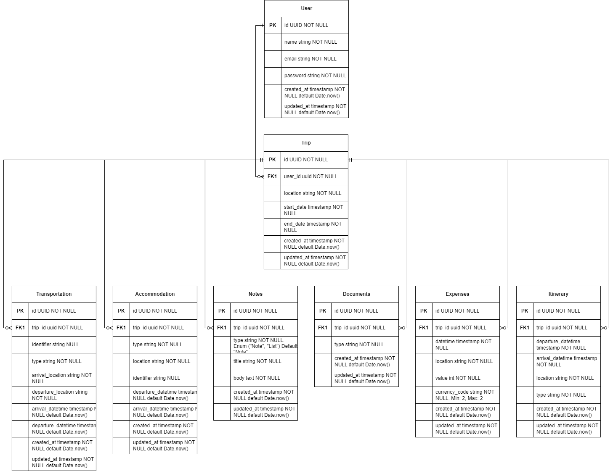

# Arquitetura da Solução
Arquitetura de Solução
1. Definição dos Componentes Principais
Front-end (Interface com o Usuário):

Páginas/Web Views: Home, Pesquisa de Destinos, Planejamento de Rota, Reservas, Diário de Viagem, Controle de Gastos.
Funcionalidades: Busca interativa, filtros, autenticação de usuário, formulários para planejamento, integração com mapas, feedback do usuário.
Back-end (Lógica e Dados):

APIs: Autenticação, Gerenciamento de Usuários, Busca de Destinos, Reservas (hotéis, voos, restaurantes), Planejamento de Rotas, Controle de Gastos.
Banco de Dados: Usuários, Destinos, Reservas, Rotas, Gastos.
Serviços Externos:

APIs de terceiros para informações de viagem (ex: TripAdvisor, Google Maps, Booking.com).
Serviço de pagamento (ex: PayPal, Stripe) para reservas e compras.
Serviço de e-mail para notificações e confirmações.
2. Arquitetura Técnica
Front-end:

Tecnologias Sugeridas: React Native para desenvolvimento de app móvel e Expo para facilitar o processo de desenvolvimento, testes e deploy. Bootstrap ou Material-UI para o design.
Comunicação: Utilizar o Axios ou a Fetch API do React Native para comunicação com o back-end.
Back-end:

Framework: Node.js com Express para uma API RESTful. Fácil de usar e muita comunidade e suporte.
Banco de Dados: MongoDB para um esquema mais livre e NoSQL, ou PostgreSQL se precisar de relações mais estritas.
Autenticação: JWT (JSON Web Tokens) para uma gestão segura de sessões.
Infraestrutura:

Servidor: AWS EC2 ou Heroku para hospedagem fácil e escalável do back-end. Expo Cloud para hospedagem do código JavaScript do app.
Armazenamento: AWS S3 para armazenar imagens e arquivos estáticos.
CDN: Cloudflare para distribuição de conteúdo e segurança.
3. Segurança e Manutenção
Implementar autenticação e autorização robustas.
Validação de dados tanto no cliente quanto no servidor.
Criptografia de senhas e dados sensíveis.
Backup regular do banco de dados.
Monitoramento e logs para identificar e resolver problemas rapidamente.
Qualidade do Software:
Testes: Implementar testes automatizados em todos os níveis do projeto, utilizando Jest com React Testing Library para o front-end e Jest ou Mocha para o back-end.
Revisão de Código: Utilizar práticas de revisão de código, como pull requests e code reviews.
Monitoramento de Performance e Saúde da Aplicação: Usar ferramentas como Sentry, Prometheus ou Grafana.
4. Desenvolvimento e Implantação
Desenvolvimento: 
Testes: Implemente testes unitários e de integração.
Implantação: Automatize a implantação com CI/CD, utilizando GitHub Actions, Bitrise ou CircleCI para React Native. Utilize Expo para construir os binários do app e publicá-los nas lojas de aplicativos.

Definição de como o software é estruturado em termos dos componentes que fazem parte da solução e do ambiente de hospedagem da aplicação.

## Diagrama de Classes

## Modelo ER

## Esquema Relacional

## Modelo Físico

[Arquivo](../src/bd/table_scripts.sql).

## Tecnologias Utilizadas

Descreva aqui qual(is) tecnologias você vai usar para resolver o seu problema, ou seja, implementar a sua solução. Liste todas as tecnologias envolvidas, linguagens a serem utilizadas, serviços web, frameworks, bibliotecas, IDEs de desenvolvimento, e ferramentas.

Apresente também uma figura explicando como as tecnologias estão relacionadas ou como uma interação do usuário com o sistema vai ser conduzida, por onde ela passa até retornar uma resposta ao usuário.

## Hospedagem

Explique como a hospedagem e o lançamento da plataforma foi feita.

> **Links Úteis**:
>
> - [Website com GitHub Pages](https://pages.github.com/)
> - [Programação colaborativa com Repl.it](https://repl.it/)
> - [Getting Started with Heroku](https://devcenter.heroku.com/start)
> - [Publicando Seu Site No Heroku](http://pythonclub.com.br/publicando-seu-hello-world-no-heroku.html)

## Qualidade de Software

Conceituar qualidade de fato é uma tarefa complexa, mas ela pode ser vista como um método gerencial que através de procedimentos disseminados por toda a organização, busca garantir um produto final que satisfaça às expectativas dos stakeholders.

No contexto de desenvolvimento de software, qualidade pode ser entendida como um conjunto de características a serem satisfeitas, de modo que o produto de software atenda às necessidades de seus usuários. Entretanto, tal nível de satisfação nem sempre é alcançado de forma espontânea, devendo ser continuamente construído. Assim, a qualidade do produto depende fortemente do seu respectivo processo de desenvolvimento.

A norma internacional ISO/IEC 25010, que é uma atualização da ISO/IEC 9126, define oito características e 30 subcaracterísticas de qualidade para produtos de software.
Com base nessas características e nas respectivas sub-características, identifique as sub-características que sua equipe utilizará como base para nortear o desenvolvimento do projeto de software considerando-se alguns aspectos simples de qualidade. Justifique as subcaracterísticas escolhidas pelo time e elenque as métricas que permitirão a equipe avaliar os objetos de interesse.

> **Links Úteis**:
>
> - [ISO/IEC 25010:2011 - Systems and software engineering — Systems and software Quality Requirements and Evaluation (SQuaRE) — System and software quality models](https://www.iso.org/standard/35733.html/)
> - [Análise sobre a ISO 9126 – NBR 13596](https://www.tiespecialistas.com.br/analise-sobre-iso-9126-nbr-13596/)
> - [Qualidade de Software - Engenharia de Software 29](https://www.devmedia.com.br/qualidade-de-software-engenharia-de-software-29/18209/)
